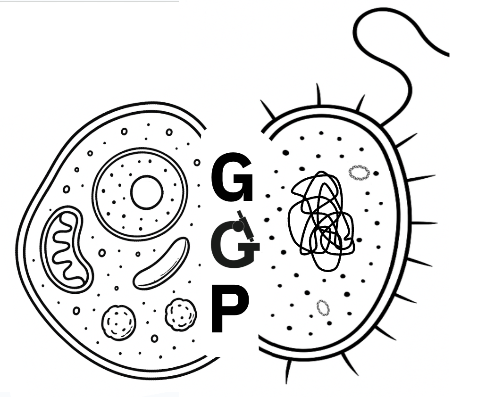

# Genomes Generation Pipeline



MGnify genomes generation pipeline (GGP) produces prokaryotic and eukaryotic MAGs from raw reads and corresponding assemblies.

<p align="center">
    
</p>


This pipeline **does not support co-binning** and was tested only on **short reads** yet.

## Pipeline summary

The pipeline performs the following tasks:

- Quality trims the reads, removes adapters [fastp](https://github.com/OpenGene/fastp).
- Runs a decontamination step using BWA to remove any host reads. By default, it uses the [hg39.fna](https://example.com/hg39.fna).
- Bins the contigs using [Concoct](https://github.com/BinPro/CONCOCT), [MetaBAT2](https://www.ncbi.nlm.nih.gov/pmc/articles/PMC6662567/) and [MaxBin2](https://flowcraft.readthedocs.io/en/latest/user/components/maxbin2.html).
- Refines the bins using the [metaWRAP](https://github.com/bxlab/metaWRAP) `bin_refinement` compatible subworkflow [supported separately](https://github.com/EBI-Metagenomics/mgbinrefinder).

For prokaryotes:

- Conducts bin quality control with [CAT](https://github.com/dutilh/CAT), [GUNC](https://github.com/CK7/GUNC), and [CheckM](https://github.com/Ecogenomics/CheckM).
- Performs dereplication with [dRep](https://github.com/MrOlm/drep).
- Calculates coverage using MetaBAT2 calculated depths.
- Detects rRNA and tRNA using [cmsearch](https://www.rfam.org/cmsearch).
- Assigns taxonomy with [GTDBtk](https://github.com/Ecogenomics/GTDBTk).

For eukaryotes:

- Estimates quality and merges bins using [EukCC](https://github.com/algbio/EukCC).
- Dereplicates MAGs using [dRep](https://github.com/MrOlm/drep).
- Calculates coverage using MetaBAT2 calculated depths.
- Assesses quality with [BUSCO](https://busco.ezlab.org/) and EukCC.
- Assigns taxonomy with [BAT](https://github.com/DRL/BAT).

Final steps: 

- Tools versions are available in `software_versions.yml`
- [MultiQC](https://seqera.io/multiqc/) report

Optional steps:

- Upload MAGs to [ENA](https://www.ebi.ac.uk/ena/browser/home) using [public MAG uploader](https://github.com/EBI-Metagenomics/genome_uploader). Applicable only for ENA related data.

## Requirements

- [Nextflow](https://www.nextflow.io/index.html#GetStarted)
- Docker/Singularity

### Required reference databases

You need to download the mentioned databases and specify as inputs to parameters (check `.nextflow.config`).

- [BUSCO](https://busco.ezlab.org/)
- [CAT](https://github.com/dutilh/CAT)
- [CheckM](https://github.com/Ecogenomics/CheckM)
- [EukCC](https://github.com/EBI-Metagenomics/EukCC)
- [GUNC](https://github.com/grp-bork/gunc)
- [GTDB-Tk](https://github.com/Ecogenomics/GTDBTk) + ar53_metadata_r*.tsv, bac120_metadata_r*.tsv from [here](https://data.ace.uq.edu.au/public/gtdb/data/releases/)
- [Rfam](https://ftp.ebi.ac.uk/pub/databases/metagenomics/genomes-pipeline/rfam_14.9/rfams_cms/)
- The reference genome of your choice for decontamination. Example, human genome [hg38](https://ftp.ebi.ac.uk/pub/databases/metagenomics/pipeline-5.0/ref-dbs/hg38/)

## Pipeline inputs

> [!NOTE]
> If you will use [ENA](https://www.ebi.ac.uk/ena/browser/home) data follow [instructions](docs/ena_readme.md). 
> Otherwise, download your data and keep format as recommended in inputs description below.


### samplesheet.csv

Each row corresponds to a specific dataset with information such as row identifier `id`, the file path to the contigs file (`assembly`), and paths to the raw reads files (`fastq_1` and `fastq_2`). Additionally, the assembly identifier `assembly_accession` column. 

| id  | fastq_1                  | fastq_2                  | assembly_accession | assembly                | assembler [optional] |
|-----|--------------------------|--------------------------|--------------------|-------------------------|----------------------|
| ID  | /path/to/RUN_1.fastq.gz  | /path/to/RUN_2.fastq.gz  | ASSEMBLY           | /path/to/ASSEMBLY.fasta | metaspades_v3.15.5   |

There is an example [here](assets/samplesheet_example.csv).


## Run pipeline

```bash
nextflow run ebi-metagenomics/genomes-generation \
-profile `specify profile(s)` \
--samplesheet `samplesheet.csv` \
--outdir `full path to output directory`
```

### Optional arguments

- `--skip_preprocessing_input (default=false)`: skip input data pre-processing step that renames contig files to ID accessions.
- `--skip_prok (default=false)`: do not generate prokaryotic MAGs
- `--skip_euk (default=false)`: do not generate eukaryotic MAGs
- `--skip_concoct (default=false)`: skip CONCOCT binner in binning process
- `--skip_maxbin2 (default=false)`: skip MaxBin2 binner in binning process
- `--skip_metabat2 (default=false)`: skip METABAT2 binner in binning process
- `--merge_pairs (default=false)`: merge paired-end reads on QC step with fastp 


## Pipeline results

### Structure

```
unclassified_genomes.txt

bins
--- eukaryotes
------- run_accession
----------- bins.fa
--- prokaryotes
------- run_accession
----------- bins.fa

coverage
--- eukaryotes
------- coverage
----------- aggregated_contigs2bins.txt
------- run_accession_***_coverage
----------- coverage.tab
----------- ***_MAGcoverage.txt
--- prokaryotes
------- coverage
----------- aggregated_contigs2bins.txt
------- run_accession_***_coverage
----------- coverage.tab
----------- ***_MAGcoverage.txt

genomes_drep
--- eukaryotes
------- dereplicated_genomes.txt
------- genomes
----------- genomes.fa
--- prokaryotes
------- dereplicated_genomes.txt
------- genomes
----------- genomes.fa

intermediate_steps
--- binning
--- eukaryotes
------- eukcc
------- qs50
--- fastp
--- prokaryotes
------- gunc
------- refinement

rna
--- cluster_name
------- cluster_name_fasta
-----------  ***_rRNAs.fasta
------- cluster_name_out
----------- ***_rRNAs.out
----------- ***_tRNA_20aa.out

stats
--- eukaryotes
------- busco_final_qc.csv
------- combined_busco_eukcc.qc.csv
------- eukcc_final_qc.csv
--- prokaryotes
------- checkm2
----------- aggregated_all_stats.csv
----------- aggregated_filtered_genomes.tsv
------- checkm_results_mags.tab

taxonomy
--- eukaryotes
------- all_bin2classification.txt
------- human_readable.taxonomy.csv
--- prokaryotes
------- gtdbtk_results.tar.gz

pipeline_info
--- software_versions.yml 
```

## Citation

If you use this pipeline please make sure to cite all used software.
