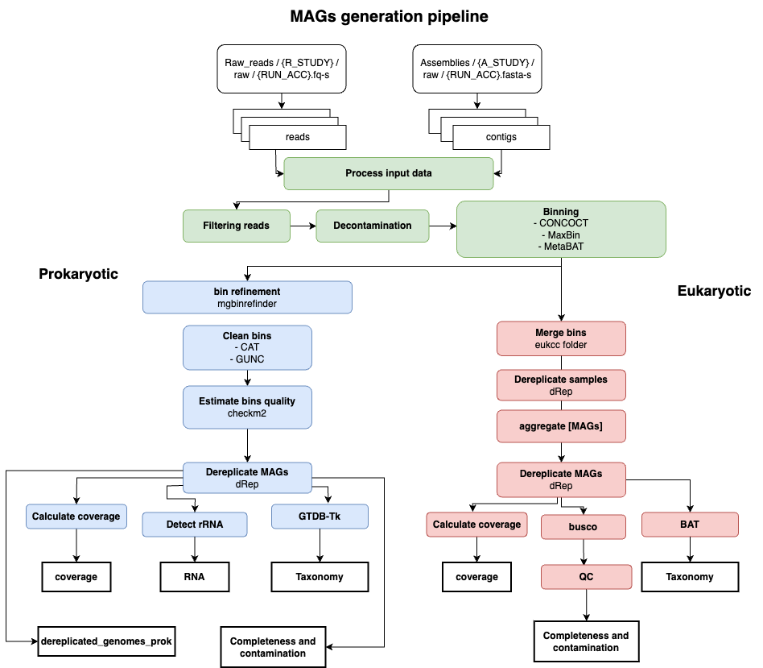

# MAGs generation pipeline
MGnify nextflow pipeline to generate prokaryotic and eukaryotic MAGs from reads and assemblies. 

<p align="center">
    
</p>

This pipeline does not support co-binning

Pipeline supports snakemake version to detect eukatyotic MAGs.

## Install requirements
- nf-core and nextflow
- tools executor to run it locally or on cluster
  - conda
  - docker
  - singularity

## Download databases
You need to download mentioned databases and add them to `config/nf_dbs.config`.
See example `config/nf_codon_dbs.config`.

Do not forget to add this config to main `.nextflow.config`
- busco
- CAT
- checkM2
- eukCC
- GUNC
- GTDB-Tk
- Rfams
- reference genome

## Input data

We expect data being downloaded from ENA. `NAME` should be **ENA RUN** accession.

Pipeline requires input data to be in the following format:

- Raw reads:
   - located in one folder, ex. `reads_folder`
   - better being **compressed**
   - header contains run accession: <NAME>
   - have name `<NAME>.fastq` the same as corresponding assembly (pipeline will link them by name)
   - example for paired end: `reads_folder/NAME1_1.fastq`, `reads_folder/NAME1_2.fastq`
   - example for single end: `reads_folder/NAME1.fastq`
- Assemblies:
   - located in one folder, ex. `assembly_folder`
   - should be **uncompressed** 
   - have name `<NAME>.fasta`
   - sequence headers contains assembly accession
   - example: `assembly_folder/NAME1.fasta`
- Rename file:
   Tab-separated file : assembly_accession \t run_accession

Example,
```
assembly_folder/ERR1.fasta
assembly_folder/ERR2.fasta

reads_folder/ERR1_1.fastq
reads_folder/ERR1_2.fastq
reads_folder/ERR2.fastq
```

## Run

Clone repo:

```bash
$ git clone https://github.com/EBI-Metagenomics/genomes-generation.git 
$ cd genomes-generation
```
Run pipeline

```bash
$ nextflow run main.nf \
  -config <config-file> \
  -profile <profile> \
  --assemblies assembly_folder \
  --raw_reads reads_folder \
  --rename_file rename.tsv
```

## Citation

If you use this pipeline please make sure to cite all used software.
