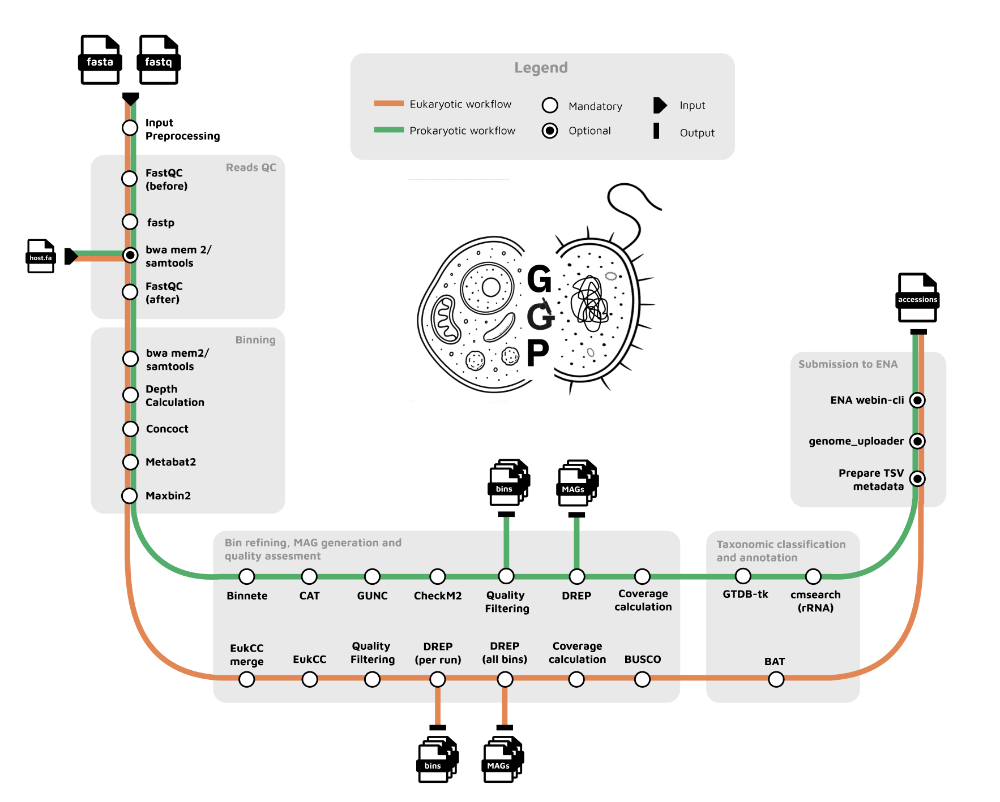

# MAGs generation pipeline

MGnify genomes generation pipeline to generate prokaryotic and eukaryotic MAGs from reads and assemblies.

<p align="center">
    
</p>


This pipeline does not support co-binning.

## Pipeline summary

The pipeline performs the following tasks:

- Supports short reads.
- Changes read headers to their corresponding assembly accessions (in the ERZ namespace).
- Quality trims the reads, removes adapters [fastp](https://github.com/OpenGene/fastp).

Afterward, the pipeline:

- Runs a decontamination step using BWA to remove any host reads. By default, it uses the [hg39.fna](https://example.com/hg39.fna).
- Bins the contigs using [Concoct](https://github.com/BinPro/CONCOCT), [MetaBAT2](https://www.ncbi.nlm.nih.gov/pmc/articles/PMC6662567/) and [MaxBin2](https://flowcraft.readthedocs.io/en/latest/user/components/maxbin2.html).
- Refines the bins using the [metaWRAP](https://github.com/bxlab/metaWRAP) bin_refinement compatible subworkflow [supported separately](https://github.com/EBI-Metagenomics/mgbinrefinder).

For prokaryotes:

- Conducts bin quality control with [CAT](https://github.com/dutilh/CAT), [GUNC](https://github.com/CK7/GUNC), and [CheckM](https://github.com/Ecogenomics/CheckM).
- Performs dereplication with [dRep](https://github.com/MrOlm/drep).
- Calculates coverage using MetaBAT2 calculated depths.
- Detects rRNA and tRNA using [cmsearch](https://www.rfam.org/cmsearch).
- Assigns taxonomy with [GTDBtk](https://github.com/Ecogenomics/GTDBTk).

For eukaryotes:

- Estimates quality and merges bins using [EukCC](https://github.com/algbio/EukCC).
- Dereplicates MAGs using [dRep](https://github.com/MrOlm/drep).
- Calculates coverage using MetaBAT2 calculated depths.
- Assesses quality with [BUSCO](https://busco.ezlab.org/) and EukCC.
- Assigns taxonomy with [BAT](https://github.com/DRL/BAT).

Final steps: 

- Tools versions are available in software_versions.yml 
- Pipeline generates a tsv table for [public MAG uploader](https://github.com/EBI-Metagenomics/genome_uploader)
- TODO: finish MultiQC 

## Usage

If this the first time running nextflow please refer to [this page](https://www.nextflow.io/index.html#GetStarted)

### Required reference databases

You need to download the mentioned databases and add them to [config/dbs.config](config/dbs.config).

Don't forget to add this configuration to the main `.nextflow.config`.

- [BUSCO](https://busco.ezlab.org/)
- [CAT](https://github.com/dutilh/CAT)
- [CheckM](https://github.com/Ecogenomics/CheckM)
- [EukCC](https://github.com/EBI-Metagenomics/EukCC)
- [GUNC](https://github.com/grp-bork/gunc)
- [GTDB-Tk](https://github.com/Ecogenomics/GTDBTk) + ar53_metadata_r*.tsv, bac120_metadata_r*.tsv from [here](https://data.ace.uq.edu.au/public/gtdb/data/releases/)
- [Rfam](https://ftp.ebi.ac.uk/pub/databases/metagenomics/genomes-pipeline/rfam_14.9/rfams_cms/)
- The reference genome of your choice for decontamination. Example, human genome [hg38](https://ftp.ebi.ac.uk/pub/databases/metagenomics/pipeline-5.0/ref-dbs/hg38/)

## Data download

**! By default GGP filters out AMPLICON runs and metaT runs.**

If you use ENA data:
1) Get your Raw reads and Assembly study accessions;
2) Download data: get assemblies and runs from ENA and [generate](download_data/scripts/generate_samplesheet.py) input samplesheet.csv and software.tsv; 

Additional filters:
- filter by scientific_name use `-b SCIENTIFIC_NAME` (like in ENA records) comma separated list
- allow METATRANSCRIPTOMIC runs with `-t` (use that argument if you are sure that ENA mislabeled library_source)
```commandline
bash download_data/fetch_data.sh \
    -a assembly_study_accession \
    -r reads_study_accession \
    -c `pwd`/assembly_study_accession \
    -f "false" \
    [-b "marine sediment metagenome,sediment metagenome"] \
    [-t "true"]
```
Otherwise, download your data and keep format as recommended in Samplesheet example section below.

## Run

```bash
nextflow run ebi-metagenomics/genomes-generation \
-profile <complete_with_profile> \
--input samplesheet.csv \
--assembly_software_file software.tsv \
--metagenome "metagenome" \
--biomes "biome,feature,material" \
--outdir <FULL_PATH_TO_OUTDIR>
```

### Optional arguments

- `--xlarge (default=false)`: use high-memory config for big studies. _Study maybe considered as **big** if it has more than 300 runs. In addition, if study has less number of runs but they are very deeply sequenced it also makes sense to try that option._ 
- `--skip_preprocessing_input (default=false)`: skip input data pre-processing step that renames ERZ-fasta files to ERR-run accessions. Useful if you process data not from ENA
- `--skip_prok (default=false)`: do not generate prokaryotic MAGs
- `--skip_euk (default=false)`: do not generate eukaryotic MAGs
- `--skip_concoct (default=false)`: skip CONCOCT binner in binning process
- `--skip_maxbin2 (default=false)`: skip MaxBin2 binner in binning process
- `--skip_metabat2 (default=false)`: skip METABAT2 binner in binning process
- `--merge_pairs (default=false)`: merge paired-end reads on QC step with fastp 

## Pipeline input data

### Samplesheet example

Each row corresponds to a specific dataset with information such as an identifier for the row, the file path to the assembly, and paths to the raw reads files (fastq_1 and fastq_2). Additionally, the assembly_accession column contains ERZ-specific accessions associated with the assembly. 

| id         | assembly                  | fastq_1                             | fastq_2                             | assembly_accession |
|------------|---------------------------|-------------------------------------|-------------------------------------|--------------------|
| SRR1631112 | /path/to/ERZ1031893.fasta | /path/to/SRR1631112_1.fastq.gz      | /path/to/SRR1631112_2.fastq.gz      | ERZ1031893         |


There is example [here](assets/samplesheet_example.csv)

### Assembly software

Id column is RUN accession \
Assembly software is a tool that was used to assemble RUN into assembly (ERZ).

_If you ran `download_data/fetch_data.sh` that file already exists in catalogue folder under name `per_run_assembly.tsv`.
Otherwise, [script](download_data/scripts/generate_samplesheet.py) can be helpful to collect that information from ENA._ 

| id         | assembly_software  |
|------------|--------------------|
| SRR1631112 | Assembler_vVersion |

### Metagenome
Manually choose the most appropriate metagenome from https://www.ebi.ac.uk/ena/browser/view/408169?show=tax-tree.

### Biomes
Comma-separated environment parameters in format: 
`"environment_biome,environment_feature,environment_material"`


## Pipeline output

### Upload

Use `final_table_for_uploader.tsv` to upload your MAGs with [uploader](https://github.com/EBI-Metagenomics/genome_uploader).

There is example [here](assets/final_table_for_uploader.tsv).

! _Do not modify existing output structure because that TSV file contains full paths to your genomes._

### Structure

```
final_table_for_uploader.tsv
unclassified_genomes.txt

bins
--- eukaryotes
------- run_accession
----------- bins.fa
--- prokaryotes
------- run_accession
----------- bins.fa

coverage
--- eukaryotes
------- coverage
----------- aggregated_contigs2bins.txt
------- run_accession_***_coverage
----------- coverage.tab
----------- ***_MAGcoverage.txt
--- prokaryotes
------- coverage
----------- aggregated_contigs2bins.txt
------- run_accession_***_coverage
----------- coverage.tab
----------- ***_MAGcoverage.txt

genomes_drep
--- eukaryotes
------- dereplicated_genomes.txt
------- genomes
----------- genomes.fa
--- prokaryotes
------- dereplicated_genomes.txt
------- genomes
----------- genomes.fa

intermediate_steps
--- binning
--- eukaryotes
------- eukcc
------- qs50
--- fastp
--- prokaryotes
------- gunc
------- refinement

rna
--- cluster_name
------- cluster_name_fasta
-----------  ***_rRNAs.fasta
------- cluster_name_out
----------- ***_rRNAs.out
----------- ***_tRNA_20aa.out

stats
--- eukaryotes
------- busco_final_qc.csv
------- combined_busco_eukcc.qc.csv
------- eukcc_final_qc.csv
--- prokaryotes
------- checkm2
----------- aggregated_all_stats.csv
----------- aggregated_filtered_genomes.tsv
------- checkm_results_mags.tab

taxonomy
--- eukaryotes
------- all_bin2classification.txt
------- human_readable.taxonomy.csv
--- prokaryotes
------- gtdbtk_results.tar.gz

pipeline_info
--- software_versions.yml 
```

## Citation

If you use this pipeline please make sure to cite all used software.
