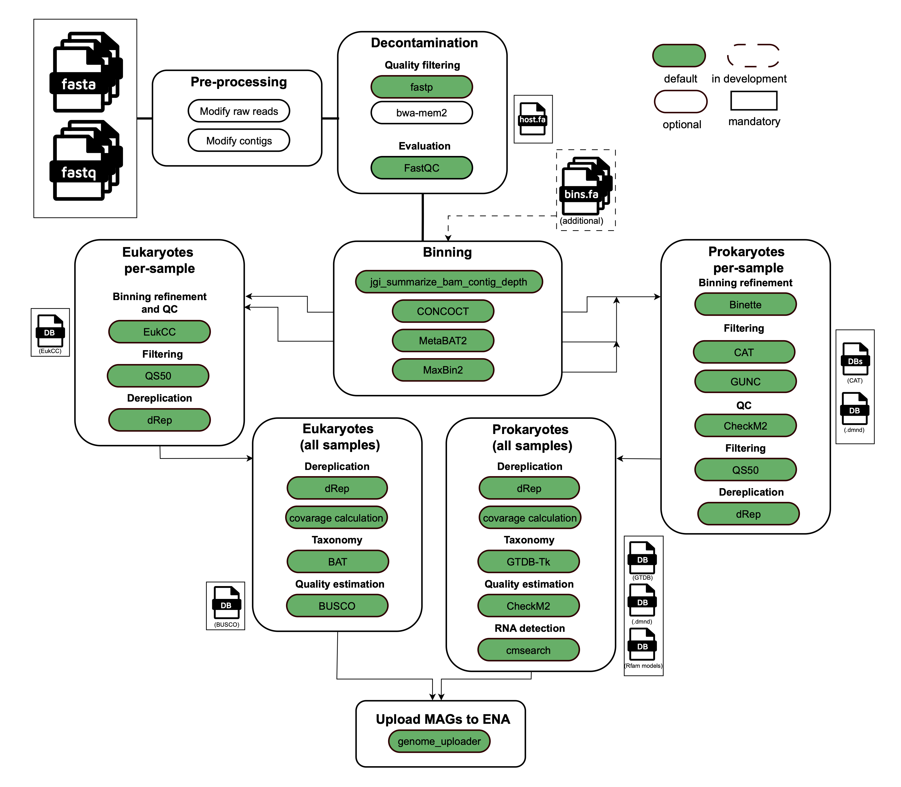

# MAGs generation pipeline

MGnify genomes generation pipeline to generate prokaryotic and eukaryotic MAGs from reads and assemblies.

<p align="center">
    
</p>

This pipeline does not support co-binning.

Pipeline supports snakemake version to detect eukatyotic MAGs.

## Pipeline summary

The pipeline performs the following tasks:

- Supports short reads.
- Renames the reads to their corresponding assembly accessions (in the ERZ namespace).
- Quality trims the reads, removes adapters, and merges paired-end reads using [fastp](https://github.com/OpenGene/fastp).

Afterward, the pipeline:

- Runs a decontamination step using BWA to remove any host reads. By default, it uses the [hg39.fna](https://example.com/hg39.fna).
- Bins the contigs using [Concoct](https://github.com/BinPro/CONCOCT).
- Refines the bins using the [metaWRAP](https://github.com/bxlab/metaWRAP) bin_refinement compatible subworkflow.

For prokaryotes:

- Conducts bin quality control with [CAT](https://github.com/dutilh/CAT), [GUNC](https://github.com/CK7/GUNC), and [CheckM](https://github.com/Ecogenomics/CheckM).
- Performs dereplication with [dRep](https://github.com/MrOlm/drep).
- Calculates coverage.
- Detects rRNA using [cmsearch](https://www.rfam.org/cmsearch).
- Assigns taxonomy with [GTDBtk](https://github.com/Ecogenomics/GTDBTk).

For eukaryotes:

- Merges bins using [EukCC](https://github.com/algbio/EukCC).
- Dereplicates MAGs using [dRep](https://github.com/MrOlm/drep).
- Calculates coverage.
- Assesses quality with [BUSCO](https://busco.ezlab.org/) and EukCC.
- Assigns taxonomy with [BAT](https://github.com/DRL/BAT).


## Usage

If this the first time running nextflow please refer to [this page](https://www.nextflow.io/index.html#GetStarted)

### Required reference databases

You need to download the mentioned databases and add them to `config/nf_dbs.config`. 
See the example `config/nf_codon_dbs.config`.

Don't forget to add this configuration to the main `.nextflow.config`.

- [BUSCO](https://busco.ezlab.org/)
- [CAT](https://github.com/dutilh/CAT)
- [CheckM](https://github.com/Ecogenomics/CheckM)
- [EukCC](https://github.com/algbio/EukCC)
- [GUNC](https://github.com/CK7/GUNC)
- [GTDB-Tk](https://github.com/Ecogenomics/GTDBTk)
- [Rfam](https://www.rfam.org/)
- The reference genome of your choice for decontamination, as a .fasta.

## Input data

```bash
nextflow run ebi-metagenomics/genomes-generation \
-profile <complete_with_profile> \
--input samplesheet.csv \
--outdir <OUTDIR>
```

### Sample sheet example

Each row corresponds to a specific dataset with information such as an identifier for the row, the file path to the assembly, and paths to the raw reads files (fastq_1 and fastq_2). Additionally, the assembly_accession column contains ERZ-specific accessions associated with the assembly. 

| id         | assembly                                  | fastq_1                             | fastq_2                             | assembly_accession |
|------------|-------------------------------------------|-------------------------------------|-------------------------------------|--------------------|
| SRR1631112 | /path/to/SRR1631112.fasta                | /path/to/SRR1631112_1.fastq.gz      | /path/to/SRR1631112_2.fastq.gz      | ERZ1031893         |


There is example [here](assets/samplesheet_example.csv)

## Pipeline output

```
bins
--- eukaryotes
------- run_accession
----------- bins.fa
--- prokaryotes
------- run_accession
----------- bins.fa

coverage
--- eukaryotes
------- coverage
----------- aggregated_contigs2bins.txt
------- run_accession_***_coverage
----------- coverage.tab
----------- ***_MAGcoverage.txt
--- prokaryotes
------- coverage
----------- aggregated_contigs2bins.txt
------- run_accession_***_coverage
----------- coverage.tab
----------- ***_MAGcoverage.txt

genomes_drep
--- eukaryotes
------- dereplicated_genomes.txt
------- genomes
----------- genomes.fa
--- prokaryotes
------- dereplicated_genomes.txt
------- genomes
----------- genomes.fa

intermediate_steps
--- binning
--- eukaryotes
------- eukcc
------- qs50
--- fastp
--- prokaryotes
------- gunc
------- refinement

rna
--- cluster_name
------- cluster_name_fasta
-----------  ***_rRNAs.fasta
------- cluster_name_out
----------- ***_rRNAs.out
----------- ***_tRNA_20aa.out

stats
--- eukaryotes
------- busco_final_qc.csv
------- combined_busco_eukcc.qc.csv
------- eukcc_final_qc.csv
--- prokaryotes
------- checkm2
----------- aggregated_all_stats.csv
----------- aggregated_filtered_genomes.tsv
------- checkm_results_mags.tab

taxonomy
--- eukaryotes
------- all_bin2classification.txt
------- human_readable.taxonomy.csv
--- prokaryotes
------- gtdbtk_results.tar.gz

pipeline_info
--- versions.yml
```

## Citation

If you use this pipeline please make sure to cite all used software.
